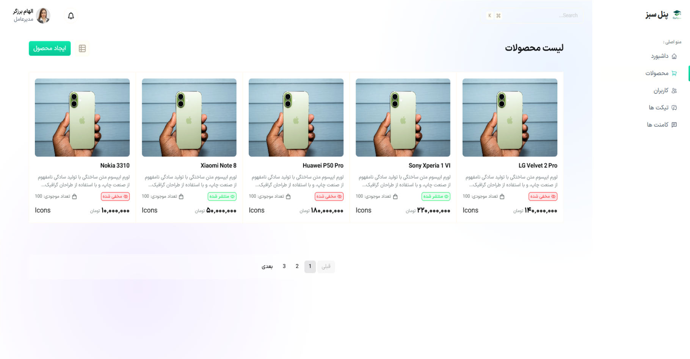

# 📊 CMS Admin Dashboard

## React + Vite

A modern and responsive CMS Admin Dashboard built with React and Tailwind CSS.

🌐 Live Demo:

https://cms-project-seven-peach.vercel.app/



## 📌 Overview

This project demonstrates a modern admin interface designed for managing digital content with a focus on usability, clean UI, and reusable components.


## ✨ Features

- Responsive admin dashboard
- Modern user interface
- Reusable React components
- Clean component architecture
- Tailwind CSS styling
- Mobile-friendly layout


## 🛠 Technologies

- React
- JavaScript
- Tailwind CSS
- HTML5
- CSS3


## 🚀 Getting Started

Clone the repository:

```bash
git clone https://github.com/elham-barzegar/CMS-project.git
